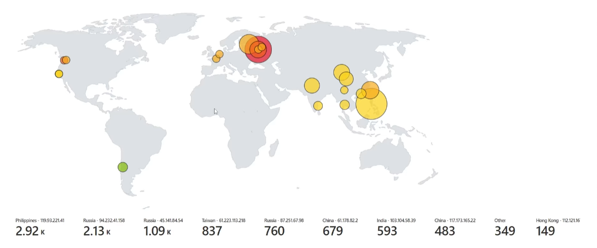

# Failed RDP Login Tracking Script 🖥️ 🔒

This PowerShell script tracks failed Remote Desktop Protocol (RDP) login attempts and logs them with IP geolocation information. The script uses the `Get-WinEvent` cmdlet to filter events with an Event ID of 4625 from the Windows Security event log, then extracts relevant information such as the username and source IP address. It then calls the IP Geolocation API to determine the geolocation information for the source IP address, and logs the information to a file.

## Features ✨

- Tracks failed RDP login attempts ❌
- Logs IP geolocation information for each attempt 🌎
- Uses IP Geolocation API to determine country, state, and latitude/longitude coordinates 🗺️
- Logs to a file for easy analysis and reporting 📄

## Prerequisites 📋

- PowerShell version 4.0 or later 💻
- An API key for the IP Geolocation API (available from https://ipgeolocation.io/) 🔑

## Usage 🚀

1. Clone this repository or download the script.
2. Open PowerShell and navigate to the directory where the script is located.
3. Set the `$API_KEY` variable to your IP Geolocation API key.
4. Run the script using `.\Security_Log_Exporter.ps1`.
5. The script will start monitoring failed RDP login attempts and logging IP geolocation information to a file located at `C:\ProgramData\failed_rdp.log`.

<h2>Attacks coming in; Custom logs output with geodata</h2>

<h2>Map of incoming attacks after 24 hours<h2>

## License 📝

[MIT](https://choosealicense.com/licenses/mit/)
